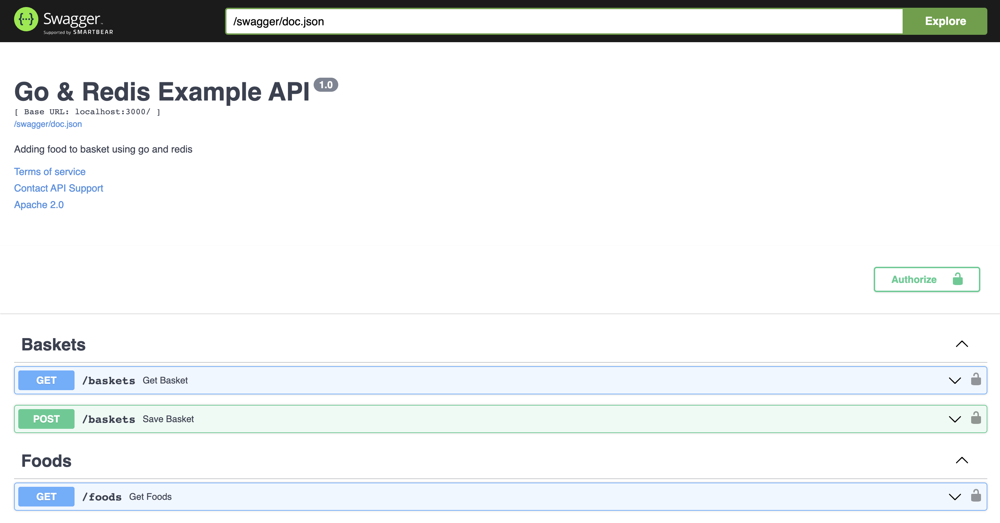

# Go & Redis Example

Hello everyone 👋🏻, I have developed a simple application with go and redis in this repo.

My aim was to gain the ability to use it by having knowledge about redis.

## Basic Auth

- **username:** Yasin
- **password:** 123456

## API Documantation

```http
  GET /swagger
```

